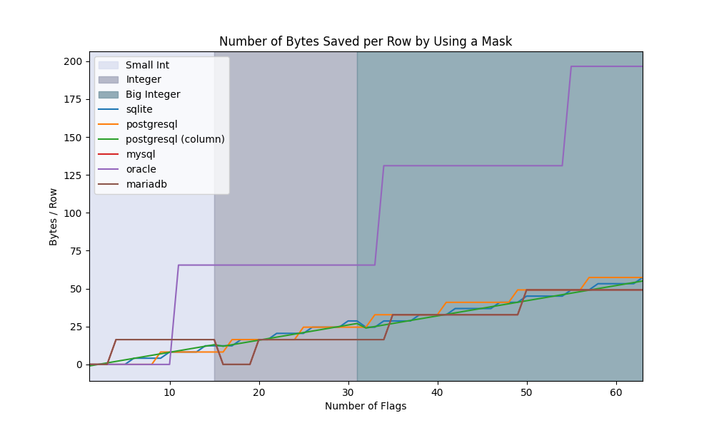
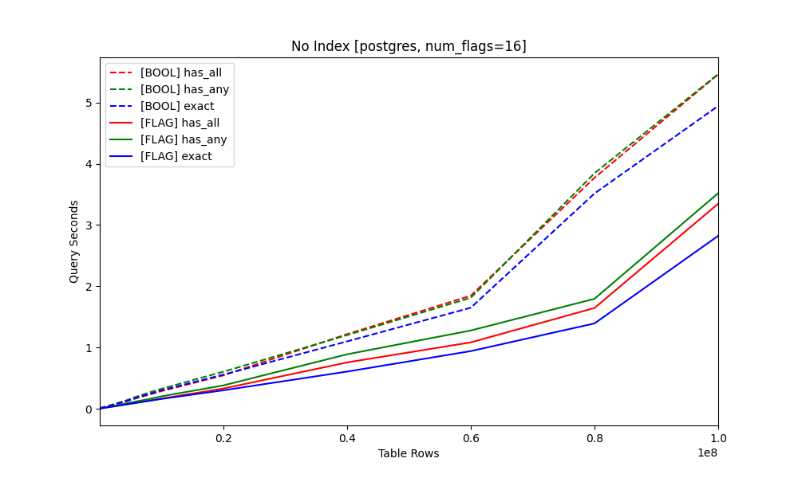
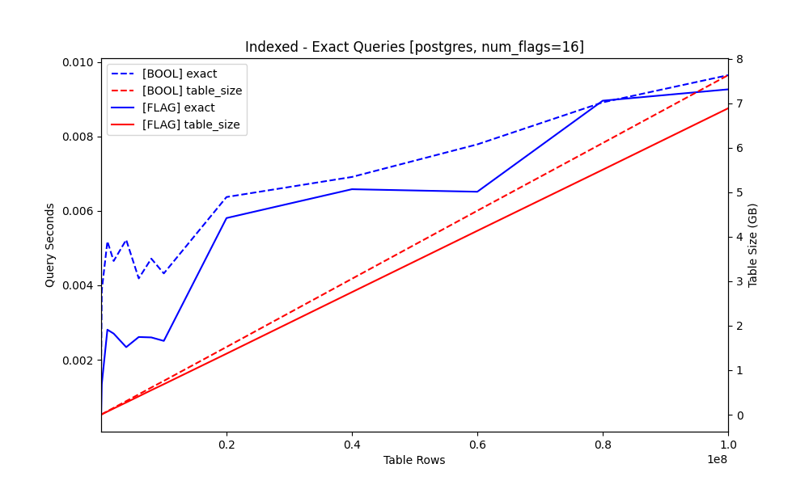
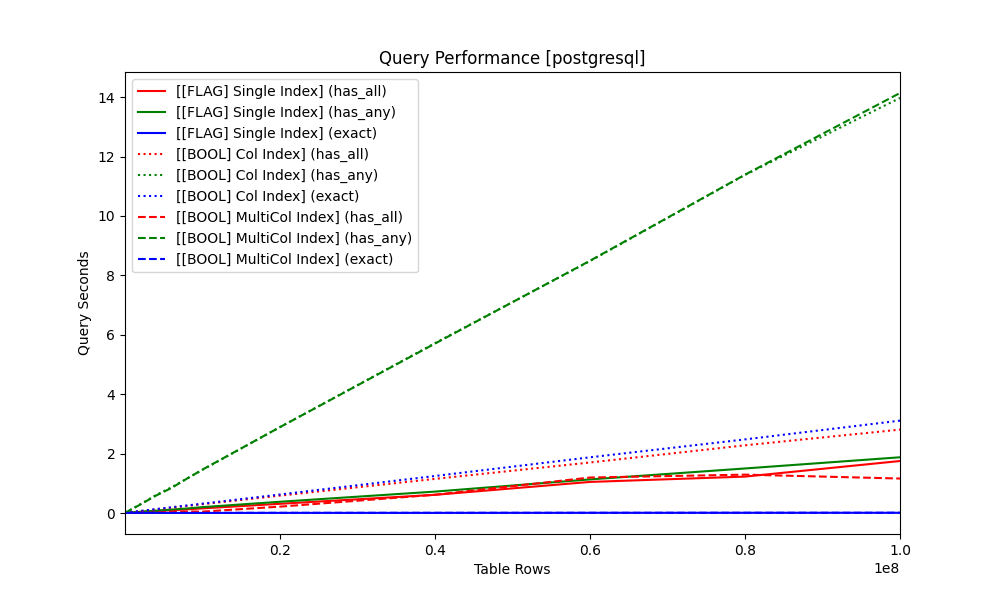

.. include:: refs.rst

.. _performance:

===========
Performance
===========

Enums
=====

The cost to resolve a raw database value into an :class:`enum.Enum` type object is non-zero but
negligible and swamped by I/O in most scenarios.

For the nominal case the marshalling penalty is roughly equivalent to a map lookup, but may involve
several exception stack unwinds in unusual non-strict or eccentric enumeration cases.

.. note::

    The marshalling penalty can be eliminated by setting ``coerce`` to ``False``. This will require
    you to manually coerce the :class:`~django_enum.fields.EnumField` value to an :class:`enum.Enum`
    type object and is therefore usually not recommended - but may be appropriate if the dominate
    use case involves high volume serialization to a primitive value instead.

.. _flag_performance:

Flags
=====

The usual advice for adding bit mask behavior to a database table is to add multiple boolean
columns. These columns can be indexed together which can speed up certain kinds of queries.
There is an obvious storage improvement when using a single column bit mask instead, but can
we achieve better query performance as well? The following benchmarks compare storage and query
performance between boolean columns and bit masks.

**Using a flag** :class:`~django_enum.fields.EnumField` **out performs boolean columns in both
storage and query speed in all tested scenarios.**

.. note::

    For all of the query plots below, bitmasks and booleans values are assigned
    randomly with each of the values having a 50% chance of being set. The
    tables with boolean columns have exactly the same mask values as the tables
    with bitmasks. 10 queries are performed and averaged at each check point.
    Each query generates a different random mask value to query and each table
    both boolean and bitmask are queried with the same mask value. The benchmarks
    were run on an Apple M1 laptop with 16GB of RAM and a 1TB SSD.

    **The PostgreSQL version was 14**

No Indexing
-----------

When no indexes are used, the flag :class:`~django_enum.fields.EnumField` saves a significant amount
of space over the boolean column model. The following plot shows the storage efficiency improvement
over boolean columns as the number of flags increases for each supported RDBMS. The oracle line
shows extents which are allocated in 64kb chunks resulting in a larger step size.

The x-axis is the number of flags and the y-axis is the number of bytes saved per row by using a
bitmask instead of a boolean column for each flag. The colored areas show the column type employed
to store the bitmask given the number of flags.

For example, using PostgreSQL a table with a 32-flag column will save ~25 bytes per row over an
equivalent table with 32 boolean columns. *For a table with a billion rows this equates to roughly
23 GB.*

Queries
~~~~~~~

When no indexes are used all three query types, `exact`, `has_all` and `has_any` perform better
when a bitmask is used. This is entirely because the bitmask takes up less space and increases row
throughput in memory as the RDBMS does a full table scan:

In this scenario a 16 flag bitmask is compared to 16 boolean columns, each of the three query types
perform roughly 20-40% faster on PostgreSQL.

Indexed Exact Queries
---------------------

When an index is used, the flag :class:`~django_enum.fields.EnumField` marginally outperforms the
boolean column equivalent in both storage and query performance for exact match queries. It is
also much simpler to define. When using the boolean column approach a multi-column index must be
used. By default PostgreSQL is compiled with a maximum multi-column index size of 32 columns. This
means that masks with more than 32 flags must be split into multiple multi-column indexes which
will further degrade performance compared to the equivalent flag
:class:`~django_enum.fields.EnumField`.

The multi-column limit on MySQL is only 16 columns.

.. todo::
    Plot a 33 flag bitmask as well.

Indexed All/Any Queries
-----------------------

:class:`~django_enum.fields.EnumField` supplies new field lookups :ref:`has_all` and :ref:`has_any`
for fields with :class:`enum.Flag` enums. :ref:`has_all` will return rows where all the flags in
the supplied value are present on the row's column and :ref:`has_any` will return all rows where
any flags on the queried value are present on the row's column. These lookups pose challenges for
indexing. The plot below compares the performance of two indexing strategies for boolean columns
to the single index strategy for a flag :class:`~django_enum.fields.EnumField`.

The test compares a 16 flag bitmask to 16 boolean columns. In the multi index case, all boolean
columns are indexed together.

This plot shows the following:

* **The flag** :class:`~django_enum.fields.EnumField` **performs as well or better than the boolean
  column equivalent for all query types.**
* Both index strategies for boolean columns perform extremely poorly for :ref:`has_any` queries
  compared to the flag :class:`~django_enum.fields.EnumField`.
* As we might expect the single index strategy for boolean columns performs poorly compared to the
  multi index strategy for :ref:`has_all` queries and flag :class:`~django_enum.fields.EnumField`
  queries.
* The flag :class:`~django_enum.fields.EnumField` and multi index strategy for boolean columns
  perform similarly for :ref:`has_all` queries and both scale extremely well for `exact`
  queries.

.. note::

    This test was run on an Apple M1 laptop with 32GB of RAM and a 1TB SSD.

