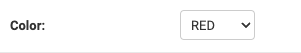

.. include:: ../refs.rst

.. _widgets_ref:

=======
Widgets
=======

The widgets below provide example renderings using these enums:

.. _color_ex:
.. literalinclude:: ../../../tests/examples/enums/color.py
    :lines: 5-

.. _permissions_ex:
.. literalinclude:: ../../../tests/examples/enums/permissions.py
    :lines: 5-

Django's builtin :class:`~django.forms.Select` widget is the default widget used for
:class:`~django_enum.fields.EnumField` fields. It renders a simple drop down select box.
For example:

.. code-block:: Python

   class Model(models.Model):
       color = EnumField(Color, default=Color.RED)

   Model.objects.create()

.. autoclass:: django_enum.forms.NonStrictSelect
   :members:
   :show-inheritance:

.. autoclass:: django_enum.forms.NonStrictSelectMultiple
   :members:
   :show-inheritance:

.. autoclass:: django_enum.forms.FlagSelectMultiple
   :members:
   :show-inheritance:

.. autoclass:: django_enum.forms.FlagCheckbox
   :members:
   :show-inheritance:

.. autoclass:: django_enum.forms.NonStrictFlagSelectMultiple
   :members:
   :show-inheritance:

.. autoclass:: django_enum.forms.NonStrictFlagCheckbox
   :members:
   :show-inheritance:

.. autoclass:: django_enum.forms.NonStrictRadioSelect
   :members:
   :show-inheritance:

Mixins
------

.. autoclass:: django_enum.forms.NonStrictMixin
   :members:

.. autoclass:: django_enum.forms.FlagMixin
   :members:

.. autoclass:: django_enum.forms.NonStrictFlagMixin
   :members:
